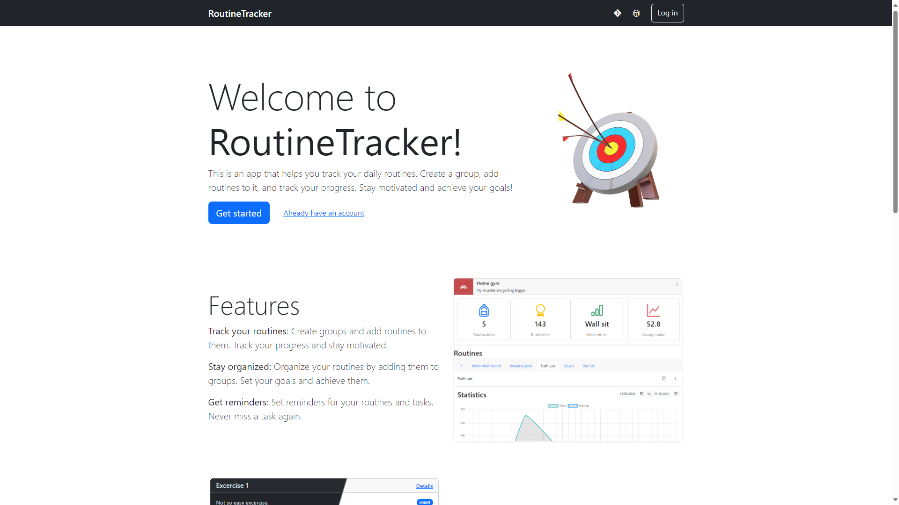

# RoutineTracker



## Project Description

This is an app that helps you track your daily routines.
Create a group, add routines to it, and track your progress. Stay motivated and achieve your goals!

## Features

- Fully implmented CRUD operations for groups and routines
- User authentication and authorization
- HTMX and Alpine.js for dynamic content loading
- Bootstrap 5 for styling
- Dockerized deployment

## Deployment

### Requirements

- Docker and Docker Compose
- Linux or macOS

### Instructions

1. Clone the repository and navigate to the project directory.

    ```bash
    git clone https://github.com/dmitlenko/routine-tracker.git
    ```

2. Create a `.env` file in the project root directory. See the [.env.example](./.env.example) file for the reference.

3. Build and run the Docker containers.

    ```bash
    docker-compose -f docker-compose.prod.yaml up -d --build
    ```

4. See the logs to check if the containers are running.

    ```bash
    docker-compose -f docker-compose.prod.yaml logs -f
    ```

## Development

### Requirements

- Python 3.12 or higher
- Poetry
- Docker and Docker Compose
- Linux or macOS
- Make

### Instructions

1. Clone the repository and navigate to the project directory.

    ```bash
    git clone https://github.com/dmitlenko/routine-tracker.git
    ```

2. Create and install dependencies using Poetry.

    ```bash
    make devenv
    ```

3. Run the dependencies using Docker Compose.

    ```bash
    make docker-up-dev
    ```

4. Apply database migrations.

    ```bash
    make migrate
    ```

5. Run the development server.

    ```bash
    make run
    ```

## License

This project is licensed under the MIT License - see the [LICENSE](./LICENSE) file for details.

## Documentation

- [Makefile commands](./docs/makefile.md)
- [Translation](./docs/translation.md)


## Acknowledgements

- [HTMX](https://htmx.org/)
- [Alpine.js](https://alpinejs.dev/)
- [Bootstrap](https://getbootstrap.com/)
- [Django](https://www.djangoproject.com/)
- [Docker](https://www.docker.com/)
- [Poetry](https://python-poetry.org/)
- [Make](https://www.gnu.org/software/make/)
